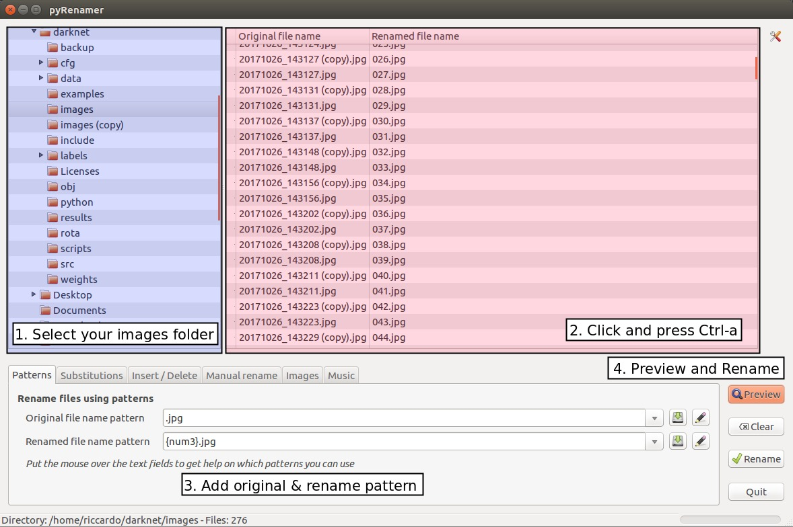

# Darknet
Darknet is an open source neural network framework written in C and CUDA. It is fast, easy to install, and supports CPU and GPU computation.

For more information see the [Darknet project website](http://pjreddie.com/darknet).

For questions or issues please use the [Google Group](https://groups.google.com/forum/#!forum/darknet).

# Training
NOTE: I have only started writing this guide for myself. It is probably not clear and surely not complete. This is at the moment just to help me keep track of what steps I am doing to train yolo, as I am sure the majority of you have seen how complicated it can be. If I get it to work, I will try to keep expanding on this, and make a very clear guide which will hopefully help out. I am using this for a university project, and currently only to train on a single class.

I am using the following to help me understand the training process:
- [How to train YOLOv2 to detect custom objects](https://timebutt.github.io/static/how-to-train-yolov2-to-detect-custom-objects/) by [Nils Tijtgat](https://github.com/timebutt)
- [Start Training YOLO with Our Own Data](http://guanghan.info/blog/en/my-works/train-yolo/) by [Guanghan](https://github.com/Guanghan)
- [Yolo-v2 Windows and Linux version](https://github.com/AlexeyAB/darknet) by [Alexey](https://github.com/AlexeyAB)

## Prerequisite
- [Darknet](https://github.com/pjreddie/darknet)
- [CUDA](http://docs.nvidia.com/cuda/cuda-installation-guide-linux/index.html)
- [cuDNN v7.0 Runtime Library](https://developer.nvidia.com/rdp/cudnn-download), install [instructions](http://docs.nvidia.com/deeplearning/sdk/cudnn-install/index.html)
- [Anaconda](https://www.anaconda.com/download/#linux) for Python 2.7
NOTE: CUDA and cuDNN are not necessary, if you decide to install them, make sure your system meets the requirements. OpenCV can also be optionally installed

## 1 - Gather & format data
If you already have your data in the correct format, skip to [step 2](https://github.com/RiccardoGrin/darknet#2---labeling).   NOTE: Check if any steps can be skipped (eg. No need to change image format if its already .jpg, and no need to flip to duplicate number of images, if you already have >250).

Though there are many image datasets/databases online, I could not find the images which I wanted, or they were part of a very large set, or the download was simply too large. Therefore, I used my  phone to take photos, however the smallest photos I could take were 3264\*1836, and their names were not as desired. From research, apparently at least 250 different images are needed for each class. Taking 250 photos can take some time and creativity, therefore I took only half, and then flipped, renamed, and resized them.  
NOTE: Images need to be in .jpg format. If they are not, then you will need to also change their format.

Steps 1.1 to 1.3, require Imagemagick. Install using: `sudo apt-get install imagemagick`

### 1.1 - Batch convert images format (eg .png to .jpg):
- Travel to folder with images to convert via terminal
- Convert image format: `mogrify -format jpg *.png`

### 1.2 - Batch flip (mirror):
- Copy all images to be flipped and paste them in the same folder (should be renamed to img_name(copy).jpg)
- Flip all image copies from the terminal: `mogrify -flop *(copy).jpg`

### 1.3 - Batch resize:
- Travel to the folder containing all image to be resized using the terminal
- Resize keeping aspect ratio: `mogrify -resize 640x360 *.jpg`

### 1.4 - Batch rename:
- Install PyRenamer `sudo apt-get install pyrenamer`
- Open it: `pyrenamer`
- Travel to folder containng images from the left panel
- On the right preview panel, select/highlight all images by pressing `ctrl-a`
- In the "Original file name pattern" box, type ".jpg"
- In the "Renamed file name pattern" box, type "{num3}.jpg"
- Click on the Preview button to see changes to be made. This will rename all .jpg images to ascending numbers (000, 001, 002, etc...)
- Press the Rename button to complete

   

## 2 - Labeling
To make the process easier, I have changed the orginal [BBox-Label-Tool](https://github.com/puzzledqs/BBox-Label-Tool.git) by [puzzledqs](https://github.com/puzzledqs), so that images would not need to be shifted from place to place. Also I have made it so that you can open a file with the name of the class in the images folder.
- In the home directory, clone the revised BBox-Label-Tool: `git clone https://github.com/RiccardoGrin/BBox-Label-Tool`
- Open `main.py` in an editor (I personally preder Atom)
- Change lines 109 and 123 to point to your 'images' and 'labels' folders respectively
- Create a folder within the 'images' folder, for each class, with the class name
- Collect each image from each class and place it in their respective folder
- Create a folder within the 'labels' folder, for each class, with the class name
- Open main: `python main.py`
- Label every image (will take some time)

NOTE: If you cannot open 'main.py', check if python is opened as the default or Anaconda version by opening it from the terminal by typing `python`. If it is the defaults version, open `.bachrc` from the home directory using an edition (Atom, nano, vim, etc...), and add at the very end `export PATH=~/anaconda2/bin:$PATH`, then in the command line type `source .bashrc`. Try to open 'main.py' again.

### 2.1 - Converting labels
- Download [convert.py](https://github.com/Guanghan/darknet/tree/master/scripts), written by [Guanghan](https://github.com/Guanghan)
- Move convert.py to `darknet/scripts`
- Change the paths to your own
- Run `python convert.py` from the scripts directory

## 3- Creating train/test sets
- Create within scripts, process.py from the code by [Nils Tijtgat](https://github.com/timebutt)  as seen on his [guide](https://timebutt.github.io/static/how-to-train-yolov2-to-detect-custom-objects/)
- Update the input directories to point to your images files
- Update save directory to what you desire (for example within data directory)
- Run `python process.py` from the scripts directory

## 4 - Preparing configuration files
- Go into the cfg directory
- Create a `obj.data` file with the following text
      classes = 1  
      train = data/train.txt  
      valid = data/test.txt  
      names = obj.names  
      backup = backup/
- Create a `obj.names` file, where every line should be a different class names
- Duplicate `yolo-voc.cfg`, and change the name to `obj.cfg`
    - line 3: set `batch=64`
    - line 4: set `subdivisions=8`
    - line 244: set `classes=1`
    - line 237: set `filters=30`, (calculated as `(classes + 5)*5`)
- Make a folder named `backup` in the main darknet directory
- Download [darknet19_488.conv.23](https://pjreddie.com/media/files/darknet19_448.conv.23), and save it into the cfg directory

## 5 - Training
- Open the darknet Makefile and switch GPU and CUDNN to 1 (if set up completed)
- Run `make` if you have not done so already
- Run `./darknet detector train cfg/obj.data cfg/obj.cfg darknet19_448.conv.23`

This will save save a `.weights` files within the backup folder, initially every 100 iterations, till 1000, and then up by 1000 after that. Make sure to read the nice [explanation](https://github.com/AlexeyAB/darknet#when-should-i-stop-training) by [Alexey](https://github.com/AlexeyAB) on when to decide to stop training.

If the training is ever interrupted at any point, it can be continued by substituting the last saved `.weights` file from the backup folder, with `darknet19_448.conv.23`, in the training command

## 6 - Testing
Test your newly trained algorithm by running, `./darknet detector test cfg/obj.data cfg/obj.cfg obj1000.weights data/image.jpg`

## TO FIGURE OUT
- [ ] `.weights` files stop saving after 900 iterations, though I kepts it going over 2000
- [ ] how to train multiple classes
- [ ] point all files to same images & labels folder, without having to move them
